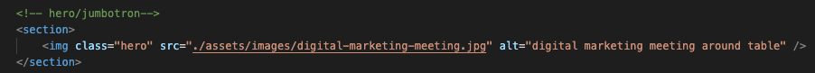

# horiseon-refactor #
## Description   
The Horiseon refactor project was built to consolidate a clients html and css as well as edit some minor issues with the given programming. The edits made will make maintaining and adding to the clients product more functional and easier to edit in the future. Adding secondary class selectors helped reduce the amount of duplicate code throughout the css file. Originally the hero img was linked thru the css file, but that caused the page to load too slowly. Linking through the original html file as seen below helped load the page faster while also keeping all of the imgages sources on the same page.  

 
Come visit and see the finished product! https://mrhumpherys.github.io/horiseon-refactor/
